# SE2525 Mobile App

This is the mobile client for the SE2525 project, built with React Native. It features a complete e-commerce experience including authentication, product browsing, cart management, and user profiles.

## Table of Contents
- [Prerequisites](#prerequisites)
- [Installation](#installation)
- [Running the App](#running-the-app)
- [Project Structure](#project-structure)
- [Screenshots](#screenshots)
- [Troubleshooting](#troubleshooting)

## Prerequisites

Ensure you have the following installed on your development machine:
- **Node.js** (>= 18)
- **Yarn** (Preferred package manager)
- **Java Development Kit (JDK)** (version 17 is recommended for React Native 0.78)
- **Android Studio** (with Android SDK and Emulator)
- **Xcode** (for iOS development, Mac only)
- **CocoaPods** (for iOS dependencies)

## Installation

1.  **Clone the repository:**
    ```bash
    git clone <repository_url>
    cd se2525-13.2/mobile
    ```

2.  **Install dependencies:**
    ```bash
    yarn install
    ```

3.  **iOS specific (Mac only):**
    ```bash
    cd ios
    pod install
    cd ..
    ```

## Running the App

### Android

To run the Android application:

1.  Start the Metro bundler:
    ```bash
    yarn start
    ```

2.  In a separate terminal, run the Android app:
    ```bash
    yarn android
    ```

   *Note: This will automatically generate a `debug.keystore` if one is missing in `android/app`.*

### iOS

To run the iOS application:

1.  Start the Metro bundler:
    ```bash
    yarn start
    ```

2.  Run the iOS app:
    ```bash
    yarn ios
    ```

## Project Structure

The project follows a standard React Native directory structure:

```
mobile/
├── android/            # Android native code
├── ios/                # iOS native code
├── src/
│   ├── apis/           # API integration
│   ├── assets/         # Images, fonts, and other static assets
│   ├── components/     # Reusable UI components
│   ├── constants/      # App constants (colors, fonts, sizes)
│   ├── models/         # TypeScript interfaces/types
│   ├── navigators/     # React Navigation setup (Stack, Tab, Drawer)
│   ├── redux/          # Redux state management (slices, store)
│   ├── screens/        # Screen components (Auth, Commerce, Profile, etc.)
│   ├── styles/         # Global styles
│   └── utils/          # Utility functions (validation, etc.)
├── App.tsx             # Root component
└── package.json        # Dependencies and scripts
```

## Key Features

-   **Authentication**: Login, Sign Up, **Email Verification (OTP)**, Forgot Password, Social Login.
-   **Commerce**: Product listing, Product Details, Cart, Checkout.
-   **Profile**: User settings, Address management, and **Seller Dashboard**.
-   **Promotions**: Dedicated Sale Screen highlighting discounted products for users.
-   **Navigation**: Uses `@react-navigation/native` with Stack and Tab navigators.
-   **State Management**: Uses `@reduxjs/toolkit` for global state.
-   **Localization**: Multi-language support (English/Vietnamese) via `react-i18next`.

## Recent Updates (Light Theme & Redesign)

The application has undergone a significant UI overhaul to adopt a modern **Clean Light Theme**:
-   **Home Screen**: Bright, clean interface with product cards and banner carousels.
-   **Profile Screen**: Redesigned with a "System Settings" style layout, featuring grouped cards, colorful icons, and clear typography.
-   **Cart Screen**: Improved "Empty State" with visual illustrations and clean white background.
-   **Address Management**: Refined "Add/Edit Address" screens with proper spacing and clearer input forms.
-   **User Verification**: Added a dedicated **Verification Screen** during the valid sign-up process. Users now receive a 4-digit OTP via email to confirm their account before logging in.


## Screenshots

### Onboarding

The Onboarding flow introduces users to the app's core value proposition through a 3-step swipable guide:
1.  **Browse Products**: Discover a wide variety of items.
2.  **Easy Ordering**: Seamless checkout process.
3.  **Fast Delivery**: Get your items delivered quickly.

Users can navigate through the guide using "Next" or bypass it with "Skip" to jump directly to the Login screen.

<p float="left">
  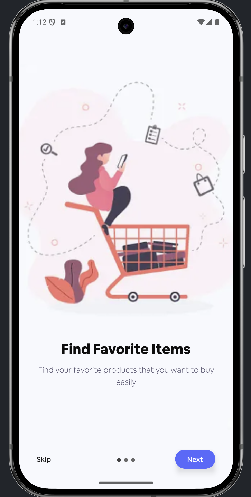
  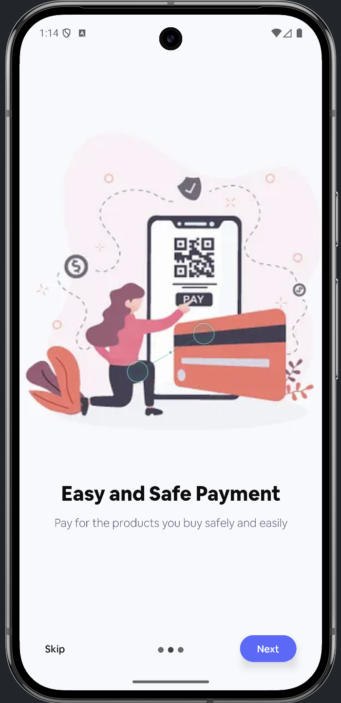
  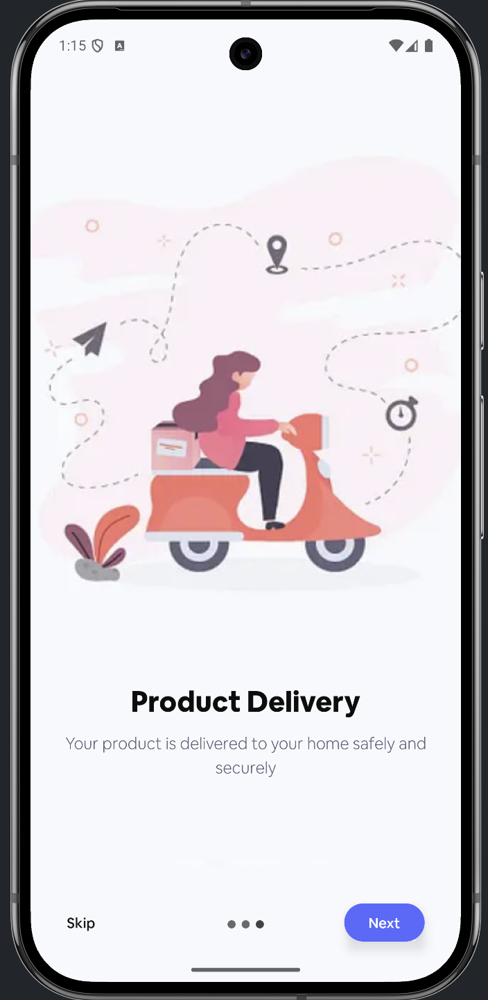
</p>

### Authentication

Comprehensive user management flow including secure usage instructions and error handling.

<p float="left">
  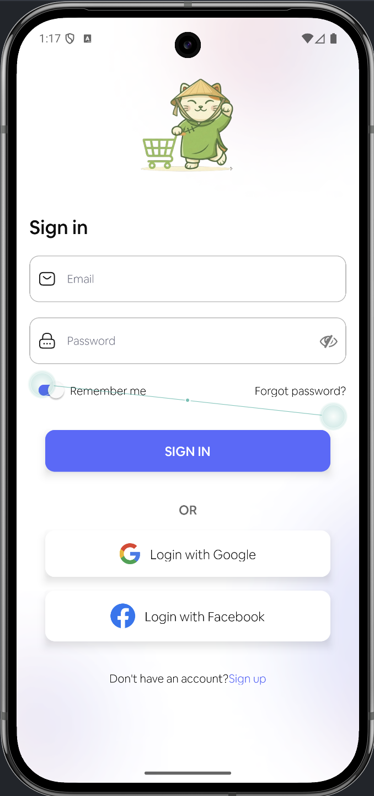
  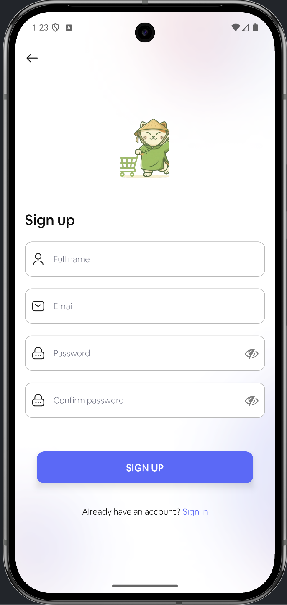
  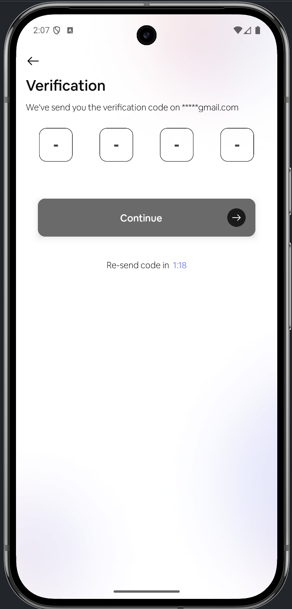
  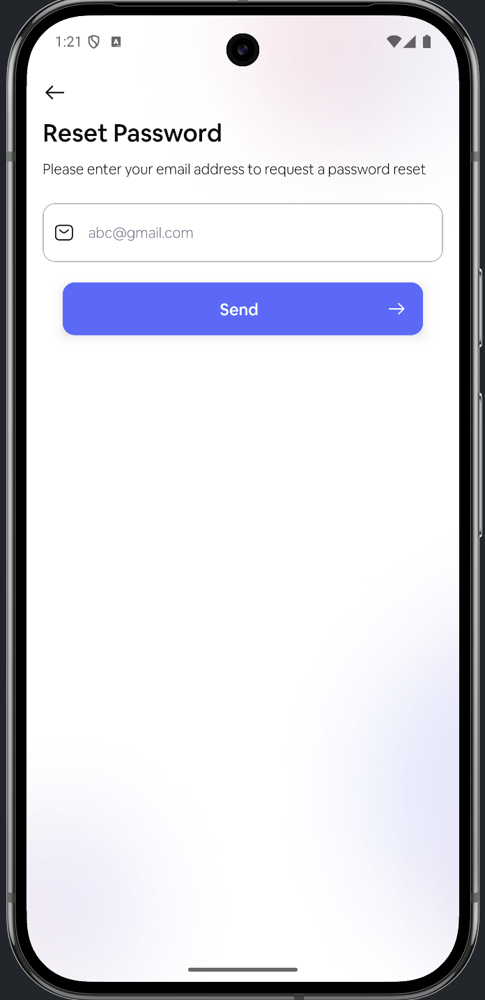
</p>

#### 1. Login
*   **Description**: Access your account using email and password or Social Login (Google/Facebook).
*   **Usage**: Enter credentials and tap "Sign In". Use "Remember me" to stay logged in.
*   **Common Errors**:
    *   *"Invalid email or password"*: Check credentials.
    *   *"Network Error"*: Check internet connection.

#### 2. Sign Up
*   **Description**: Create a new account to start shopping.
*   **Usage**: Provide valid Personal Info (Name, Email) and a strong Password.
*   **Validation**: Email must be unique. Password must be min 6 chars.

#### 3. Verification
*   **Description**: Security step to valid email ownership.
*   **Usage**: Enter the **4-digit OTP** sent to your registered email.
*   **Troubleshooting**:
    *   *No code received?*: Check Spam folder or wait 30s to request a new code.
    *   *Code expired*: Request a new OTP.

#### 4. Forgot Password
*   **Description**: Recover access to your account.
*   **Usage**: Enter registered email to receive a password reset link/OTP.


### Main Application
Explore products, manage cart, and complete purchases seamlessly.

<p float="left">
  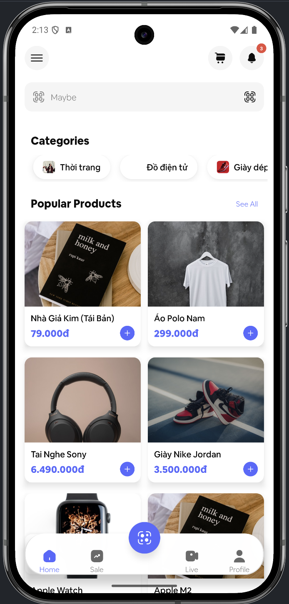
  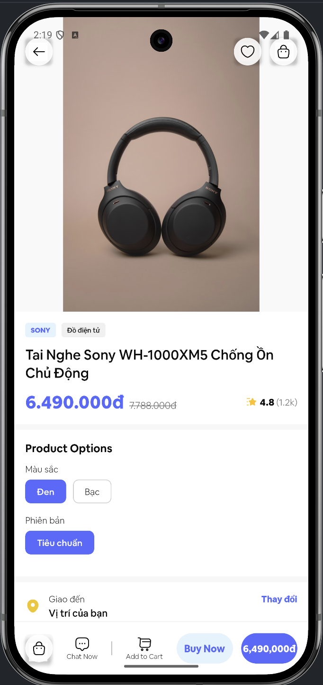
  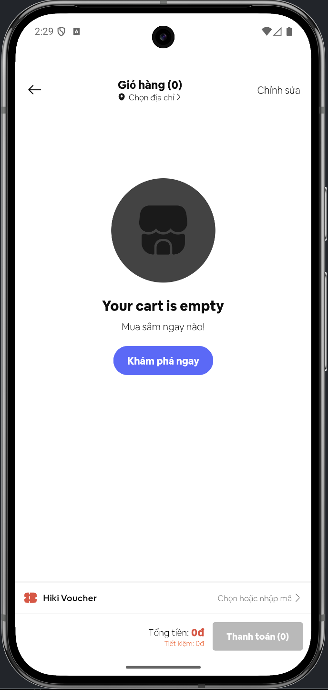
  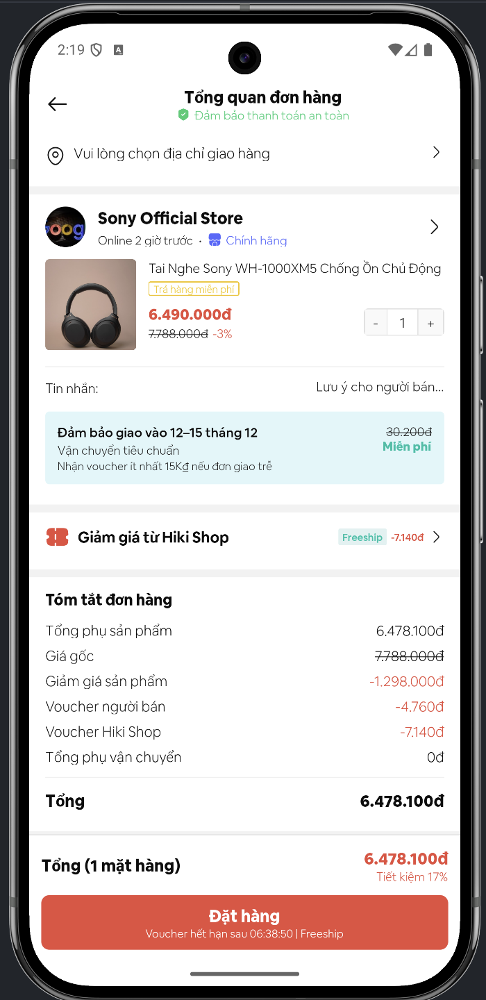
</p>

#### 1. Home Screen
*   **Description**: The central hub for product discovery.
*   **Features**:
    *   **Categories**: Quick access to different product types.
    *   **Carousels**: Featured banners and sales.
    *   **Search**: Find specific items instantly.

#### 2. Product Detail
*   **Description**: In-depth view of a selected item.
*   **Usage**: Select size/color, view images, and read specifications.
*   **Actions**: "Add to Cart" or "Buy Now".

#### 3. Shopping Cart
*   **Description**: Review selected items before purchase.
*   **Usage**: Adjust quantities or remove items.
*   **Empty State**: Visual prompt to start shopping if cart is empty.

#### 4. Checkout (Bill)
*   **Description**: Finalize your order.
*   **Usage**: Select shipping address and payment method.
*   **Confirmation**: Review total cost including shipping fees.

### User Profile & Settings
Manage personal preferences and addresses.

<p float="left">
  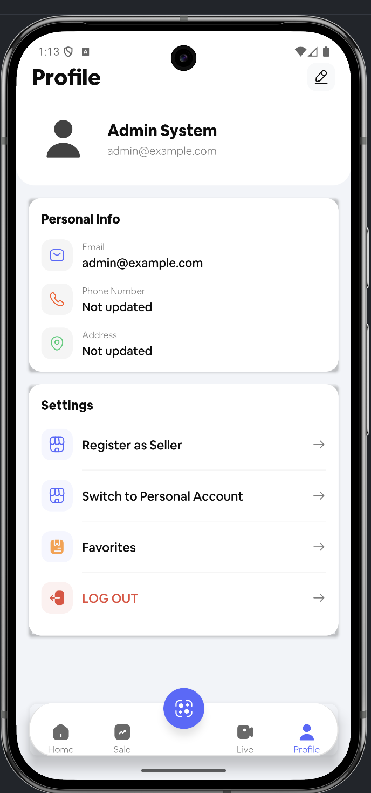
  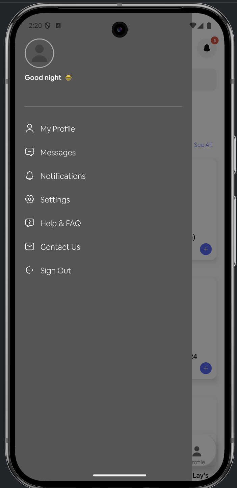
  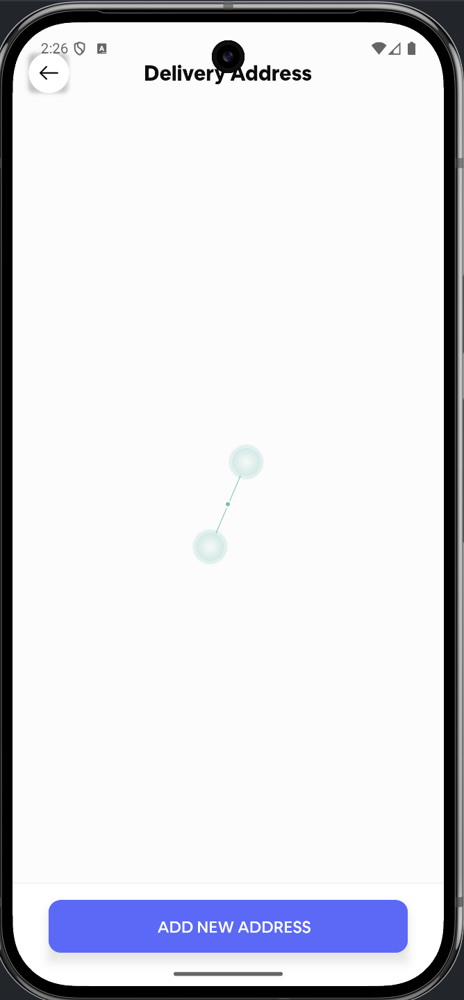
  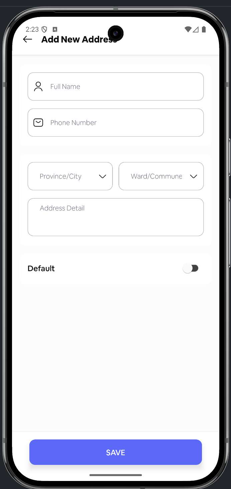
</p>

#### Profile Features
*   **Dashboard**: Access personal info, order history, and settings.
*   **Address Management**: Add multiple delivery addresses.
*   **Settings**: Toggle options like Language (EN/VI) or Notifications.

### Sale & Seller Features
Special offers and merchant tools.

<p float="left">
  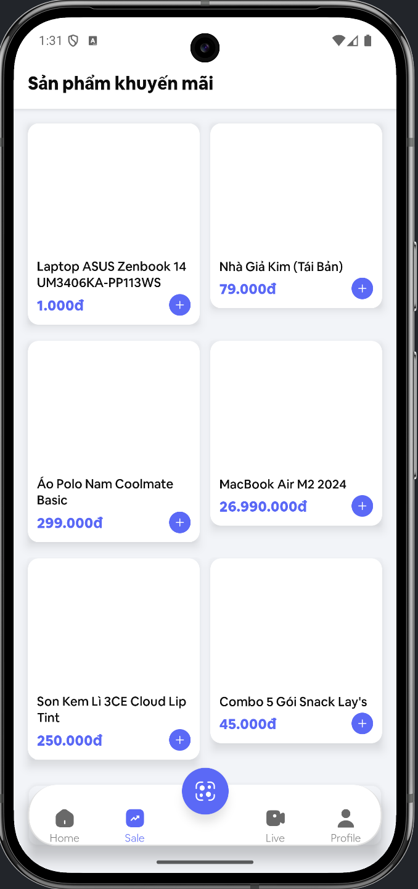
  
</p>

#### Features
*   **Sale Screen**: Curated list of discounted items.
*   **Seller Registration**: Flow for users to apply to become a merchant.

## Troubleshooting

### Android Build Issues

*   **`debug.keystore` missing**: The app requires a debug keystore to sign the APK. If you see a keystore logging error, ensure `android/app/debug.keystore` exists. You can generate it using:
    ```bash
    keytool -genkey -v -keystore android/app/debug.keystore -alias androiddebugkey -keyalg RSA -keysize 2048 -validity 10000
    ```
    *(Password: `android`)*

*   **`react-native-screens` errors**: This project requires `react-native-screens` version **4.18.0** to be compatible with other navigation libraries. Do not upgrade this package without verifying compatibility.

### Runtime Errors

*   **"No bundle URL present"**: Ensure the Metro bundler is running (`yarn start`).
*   **"INSTALL_FAILED_INSUFFICIENT_STORAGE"**: Free up space on your emulator or device by uninstalling unused apps.

## License

[Add License Here]
